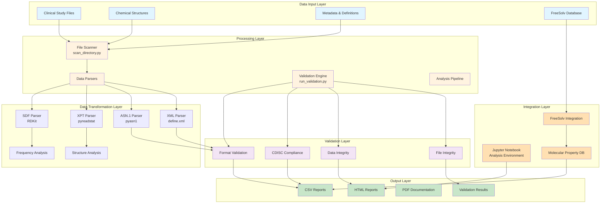
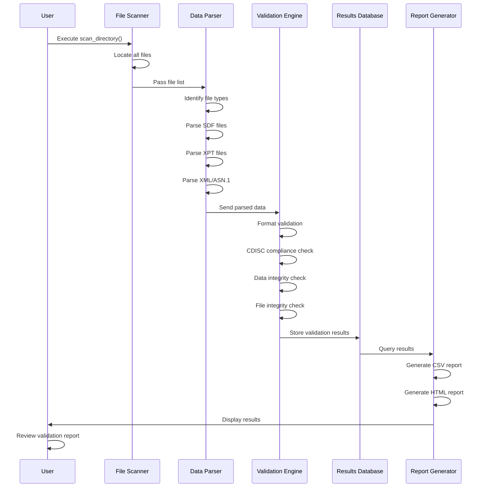
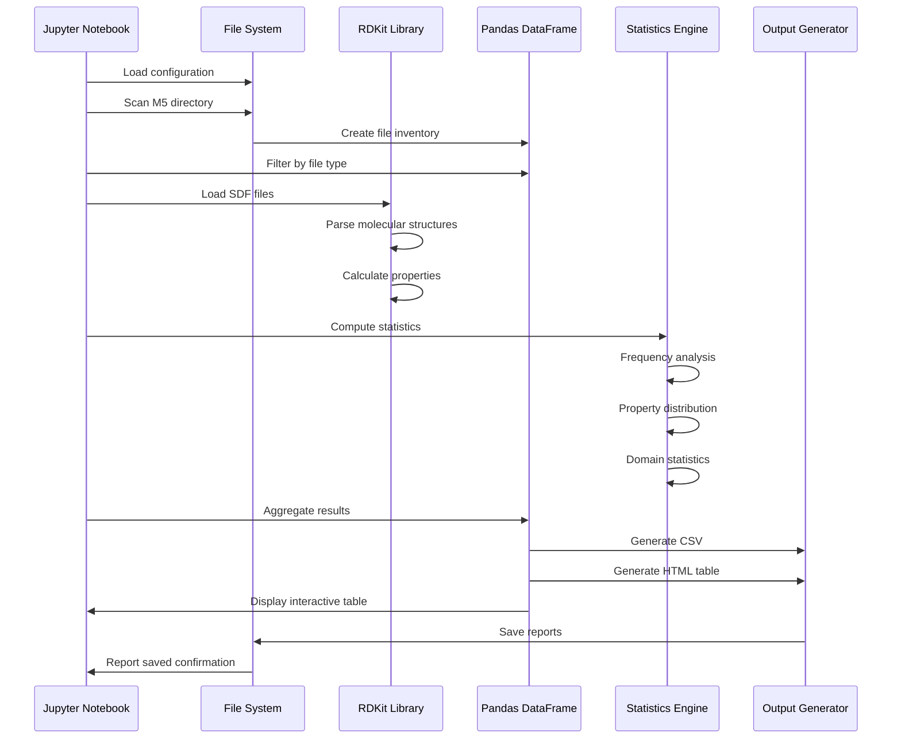
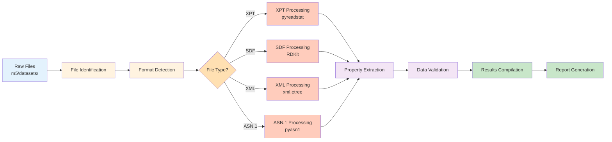
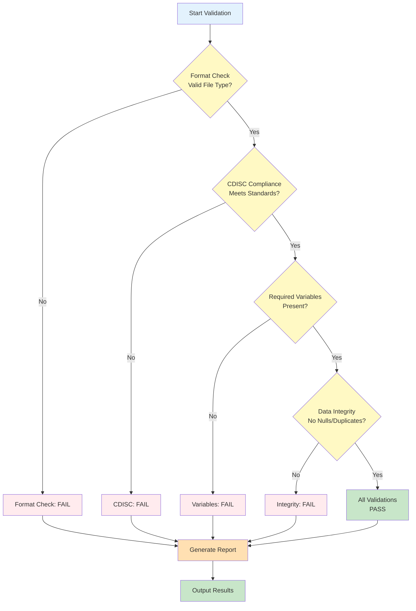
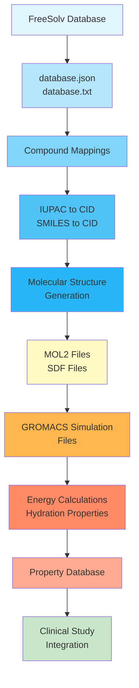

# SD Study Data Files - Comprehensive Documentation

**Repository Owner:** SAMeh-ZAGhloul  
**Current Branch:** main  
**Last Updated:** December 2025

---

## 📋 Table of Contents

1. [Project Overview](#project-overview)
2. [Repository Structure](#repository-structure)
3. [Architecture Diagram](#architecture-diagram)
4. [Workflow & Sequence Diagrams](#workflow--sequence-diagrams)
5. [Data Standards & Domains](#data-standards--domains)
6. [File Types & Specifications](#file-types--specifications)
7. [Installation & Setup](#installation--setup)
8. [Usage Guide](#usage-guide)
9. [Validation Framework](#validation-framework)
10. [FreeSolv Database Integration](#freesolv-database-integration)
11. [Development Guide](#development-guide)

---

## Project Overview

This repository contains a comprehensive system for managing, validating, and analyzing **Study Data (SD) files** from clinical and nonclinical studies. It implements FDA-compliant regulatory data submission standards including **SDTM, ADaM, and SEND** models.

### Key Objectives

- **Data Management**: Store and organize clinical study data following CDISC standards
- **Validation**: Ensure regulatory compliance and data integrity before submission
- **Analysis**: Process and analyze molecular structures, clinical datasets, and metadata
- **Integration**: Combine molecular simulation data (FreeSolv) with clinical datasets

### Primary Use Cases

1. **Regulatory Submissions**: Prepare eCTD submissions for FDA/EMA approval
2. **Data Quality**: Validate datasets before regulatory submission
3. **Chemical Analysis**: Process molecular structures and compounds
4. **Research**: Analyze hydration free energy and molecular properties

---

## Repository Structure

```
SD_Study-Data-files_Validation/
├── README.md                              # Original repository README
├── DETAILED_README.md                     # This comprehensive documentation
├── validation_README.md                   # Validation checklist and guidelines
├── validation_report.txt                  # Latest validation results
├── validation_results.csv                 # Detailed validation metrics
├── integrity_results.csv                  # File integrity check results
├── run_validation.py                      # Main validation script
├── sample_file_summary.xlsx               # File summary spreadsheet
│
├── SD_Study-Data-files.ipynb              # Main analysis Jupyter notebook
├── SD_Study-Data-files.csv                # Generated file analysis summary
├── SD_Study-Data-files.html               # HTML report output
├── SD_Study-Data-files.pdf                # PDF documentation
├── SD_Study-Data-files_validated.ipynb    # Validated analysis notebook
├── SD_Study-Data-files_validated.html     # Validated HTML report
│
├── m5/                                    # eCTD Module 5 (Study Reports)
│   └── 53-clin-stud-reports/              # Clinical study reports
│       └── study1234/                     # Study identifier
│           └── datasets/
│               └── datasets/              # CDISC datasets
│                   ├── ae.csv / ae.xpt    # Adverse Events domain
│                   ├── dm.csv / dm.xpt    # Demographics domain
│                   ├── lb.csv / lb.xpt    # Laboratory Results domain
│                   ├── define.xml         # Variable definitions
│                   ├── stf.xml            # Study metadata
│                   ├── compound.sdf       # Chemical structures
│                   ├── COMPOUND_*.json    # PubChem compound data
│                   ├── *.asnt             # ASN.1 metadata files
│                   ├── Structure*.sdf     # 2D/3D structure files
│                   ├── assessment.asnt    # Assessment metadata
│                   ├── annotated-crf.pdf  # Case report form
│                   ├── study1234-clin-report.pdf
│                   └── study1234-sdtm-rg.pdf
│
├── pinnacle21/                            # Pinnacle 21 validation files
│   ├── ae.xpt
│   ├── dm.xpt
│   └── lb.xpt
│
└── New-Data/                              # Extended data collections
    ├── Compound_151000001_151500000.sdf   # Large compound library
    │
    └── FreeSolv-master/                   # FreeSolv hydration database
        ├── database.json                  # Compound database (JSON)
        ├── database.txt                   # Compound database (text)
        ├── groups.txt                     # Functional groups
        ├── iupac_to_cid.json              # IUPAC name mapping
        ├── smiles_to_cid.json             # SMILES string mapping
        │
        ├── scripts/                       # Data processing scripts
        │   ├── rebuild_freesolv.py        # Database rebuild utility
        │   ├── extract-primary-data.py    # Data extraction
        │   ├── generate-tripos-mol2files.py # MOL2 file generation
        │   ├── make_supporting_files.py   # Support file generation
        │   ├── make_v0.32.py / make_v0.52.py # Version builders
        │   ├── hComponents.py             # Enthalpy components
        │   └── utils.py                   # Utility functions
        │
        ├── gromacs_mdpfiles/              # GROMACS simulation configs
        │   ├── DG_mdp/                    # Docking/Grid MDP files
        │   └── DH_mdp/                    # Docking/Hydration MDP files
        │       ├── in_solution/
        │       └── vacuum/
        │
        ├── gromacs_analysis/              # GROMACS analysis outputs
        │   └── plots/                     # Analysis visualizations
        │
        ├── simulation_comparison_input/   # Comparison configurations
        │   ├── energy_comparison_info.txt
        │   ├── grompp_freesolv.mdp
        │   ├── min_freesolv.in
        │   ├── onepoint_freesolv.cfg
        │   └── README.md
        │
        ├── notebooks/                     # Analysis notebooks
        │   ├── OrionDB.ipynb              # OrionDB analysis
        │   └── README.md
        │
        └── primary-data/                  # Raw experimental data
```

---

## Architecture Diagram



---

## Workflow & Sequence Diagrams

### 1. Data Validation Workflow



### 2. Jupyter Notebook Analysis Workflow



### 3. File Processing Pipeline



### 4. Validation Decision Tree



### 5. FreeSolv Integration Pipeline



---

## Data Standards & Domains

### CDISC SDTM Domains

| Domain | Code | Description | Location |
|--------|------|-------------|----------|
| **Demographics** | DM | Subject demographics, enrollment date, treatment assignment | `dm.csv`, `dm.xpt` |
| **Adverse Events** | AE | Adverse events and serious adverse events | `ae.csv`, `ae.xpt` |
| **Laboratory Results** | LB | Laboratory test results and values | `lb.csv`, `lb.xpt` |
| **Medical History** | MH | Subject medical history | Study reports |
| **Physical Examination** | PE | Physical examination findings | Study reports |
| **Vital Signs** | VS | Vital signs measurements (BP, HR, etc.) | Study reports |
| **Electrocardiogram** | EG | ECG test results | Study reports |

### Trial Summary (TS) Domain

Contains study-level metadata:
- Study identifier
- Study title
- Protocol version
- Principal investigator
- Study phase
- Therapeutic indication

### Definitions (DEFINE.XML)

Provides comprehensive metadata for all variables:
- Variable names and labels
- Data types and formats
- Variable definitions and derivations
- Validation rules
- Permissible values

---

## File Types & Specifications

### 1. SAS XPORT Format (.xpt)

**Purpose**: Transport format for SAS datasets, FDA-preferred for regulatory submissions

**Specifications**:
- Version 5 XPORT format (EBCDIC/ASCII encoded)
- Binary file containing tabulated data
- Preserves SAS metadata (variable labels, formats)
- Case-insensitive variable names (8 char max)

**Validation Checks**:
```
✓ File format = XPORT v5
✓ CDISC domain compliance
✓ Required variables present (STUDYID, USUBJID)
✓ No null values in key fields
✓ Variable names follow CDISC conventions
```

**Tools**: `pyreadstat`, Pinnacle 21 Community

### 2. Structure Data Files (.sdf)

**Purpose**: Molecular structure format containing chemical compound data

**Format**:
- Text-based format with multiple molecules
- Each molecule separated by `$$$$` delimiter
- Contains 2D/3D coordinates, bonds, atoms, and properties
- Property blocks marked with `> <PROPERTY_NAME>`

**Example Structure**:
```
Molecule Name
 Creator      Timestamp

  Atom Count  Bond Count
M  END
> <PUBCHEM_COMPOUND_CID>
123456

$$$$
```

**Validation Checks**:
```
✓ Proper SDF structure (molecules separated by $$$$)
✓ Valid atom/bond connectivity
✓ 2D/3D coordinates consistency
✓ Property blocks well-formed
✓ No corrupted molecule data
```

**Tools**: RDKit, Open Babel

### 3. Abstract Syntax Notation One (.asnt)

**Purpose**: Structured text format for regulatory metadata encoding

**Specifications**:
- ASN.1 DER or BER encoding
- UTF-8 or ASCII character encoding
- Hierarchical object structure
- Schema-based validation

**Common Uses**:
- Conformer 3D structure metadata
- 2D structure metadata
- Assessment data
- Study metadata

**Validation Checks**:
```
✓ Valid ASN.1 syntax
✓ Character encoding valid
✓ Mandatory objects present
✓ Schema compliance
```

**Tools**: pyasn1, asn1tools

### 4. XML Files (.xml, define.xml, stf.xml)

**Purpose**: Metadata and definitions in extensible markup language

**define.xml**:
- Variable definitions for SDTM domains
- Dataset-to-domain mapping
- Derivation rules
- Permissible values

**stf.xml**:
- Study-level metadata
- Study title and description
- Protocol information
- Study dates

**Validation Checks**:
```
✓ Valid XML schema
✓ All required elements present
✓ Proper nesting and hierarchy
✓ Consistent with dataset variables
```

### 5. JSON Files (.json)

**Purpose**: PubChem compound data and database records

**Contents**:
- Compound identifiers
- IUPAC names
- SMILES strings
- Molecular properties
- References and sources

**Example Fields**:
```json
{
  "CID": 197365,
  "IUPACName": "compound name",
  "SMILES": "CC(C)Cc1...",
  "MolecularWeight": 206.28,
  "ExactMass": 206.1620
}
```

### 6. Comma-Separated Values (.csv)

**Purpose**: Tabular data in text format for analysis and reporting

**Formats**:
- File inventory summary
- Validation results
- Analysis statistics
- Data quality metrics

---

## Installation & Setup

### System Requirements

- **Python**: 3.7 or higher
- **OS**: Linux, macOS, or Windows
- **Disk Space**: 10+ GB for full dataset
- **RAM**: 4+ GB recommended

### Required Python Packages

```bash
# Chemical analysis
pip install rdkit-pypi>=2022.09.1
pip install rdkit

# Data manipulation and analysis
pip install pandas>=1.5.0
pip install numpy>=1.23.0

# SAS file support
pip install pyreadstat>=1.2.0

# Bioinformatics
pip install biopython>=1.81

# ASN.1 support
pip install pyasn1>=0.4.8
pip install asn1tools>=0.154.1

# XML and serialization
pip install lxml>=4.9.0
pip install xmltodict>=0.13.0

# Data validation
pip install pydantic>=1.10.0

# Character encoding detection
pip install chardet>=5.0.0

# Excel support
pip install openpyxl>=3.9.0
```

### Quick Setup

```bash
# Clone repository
git clone https://github.com/SAMeh-ZAGhloul/SD_Study-Data-files.git
cd SD_Study-Data-files_Validation

# Create virtual environment
python -m venv venv
source venv/bin/activate  # On Windows: venv\Scripts\activate

# Install dependencies
pip install -r requirements.txt

# Verify installation
python -c "import rdkit, pandas, pyreadstat; print('All packages installed successfully')"
```

### Configuration

Create `config.py` in project root:

```python
# Data paths
DATA_ROOT = "./m5/53-clin-stud-reports/study1234/datasets/datasets"
FREESOLV_PATH = "./New-Data/FreeSolv-master"

# Validation settings
STRICT_CDISC = True
CHECK_ENCODING = True
VALIDATE_DEFINES = True

# Output settings
OUTPUT_DIR = "./results"
REPORT_FORMAT = ["csv", "html", "pdf"]
```

---

## Usage Guide

### 1. Running the Validation Script

```bash
# Full validation of all files
python run_validation.py

# Validate specific directory
python run_validation.py --input ./m5/53-clin-stud-reports/study1234

# Generate detailed report
python run_validation.py --output ./results/validation_report.txt --verbose

# Validate and fix common issues
python run_validation.py --auto-fix
```

**Output Files**:
- `validation_results.csv` - Detailed results
- `validation_report.txt` - Human-readable report
- `integrity_results.csv` - File integrity checks

### 2. Using the Jupyter Notebook

```bash
# Start Jupyter
jupyter notebook SD_Study-Data-files.ipynb

# Or use JupyterLab
jupyter lab SD_Study-Data-files.ipynb
```

**Notebook Workflow**:
1. Cell 1: Import libraries
2. Cell 2: Configure paths
3. Cell 3: Scan directory for files
4. Cell 4-6: Parse and analyze different file types
5. Cell 7-9: Generate statistics and summaries
6. Cell 10: Create comprehensive report
7. Cell 11-12: Export results to CSV/HTML

### 3. Parsing Different File Types

#### Parse XPT Files

```python
import pyreadstat

# Read XPT file
df, meta = pyreadstat.read_xport('./datasets/dm.xpt')
print(f"Format: {meta.file_format}")
print(f"Variables: {list(df.columns)}")
print(f"Rows: {len(df)}")
```

#### Parse SDF Files

```python
from rdkit import Chem

# Read SDF file
supplier = Chem.SDMolSupplier('./datasets/compound.sdf')
for mol in supplier:
    if mol is not None:
        print(f"Molecule: {mol.GetProp('_Name')}")
        print(f"Weight: {Chem.Descriptors.MolWt(mol)}")
```

#### Parse XML Files

```python
import xml.etree.ElementTree as ET

# Parse define.xml
tree = ET.parse('./datasets/define.xml')
root = tree.getroot()

for itemdef in root.findall('.//ItemDef'):
    oid = itemdef.get('OID')
    name = itemdef.get('Name')
    print(f"{oid}: {name}")
```

### 4. Data Analysis Examples

#### Analyze Demographics Domain

```python
import pandas as pd

# Load demographics
dm = pd.read_csv('./datasets/dm.csv')

# Summary statistics
print(f"Total subjects: {dm['USUBJID'].nunique()}")
print(f"Gender distribution:\n{dm['SEX'].value_counts()}")
print(f"Age range: {dm['AGE'].min()}-{dm['AGE'].max()}")
```

#### Generate Summary Report

```python
# Create comprehensive summary
summary = {
    'Study ID': dm['STUDYID'].unique()[0],
    'Total Subjects': dm['USUBJID'].nunique(),
    'Treatment Groups': dm['TRT01P'].nunique(),
    'Gender Distribution': dm['SEX'].value_counts().to_dict(),
    'Average Age': dm['AGE'].mean(),
}

# Export to CSV
pd.DataFrame([summary]).to_csv('study_summary.csv', index=False)
```

---

## Validation Framework

### Validation Architecture

```
Input Files
    ↓
[Type Detection]
    ↓
[Format Validation] → Check file format, encoding, structure
    ↓
[Metadata Validation] → Check headers, labels, definitions
    ↓
[Content Validation] → Check data types, ranges, relationships
    ↓
[CDISC Compliance] → Check domain standards, variable names
    ↓
[Integrity Checks] → Check duplicates, nulls, consistency
    ↓
Results Database
    ↓
[Report Generation]
```

### Validation Checklist

#### For XPT Files
- [ ] File format = XPORT v5
- [ ] CDISC domain compliance
- [ ] STUDYID present and consistent
- [ ] USUBJID present and unique
- [ ] All variables in define.xml
- [ ] No missing values in key fields
- [ ] Variable types correct
- [ ] Date formats consistent

#### For SDF Files
- [ ] Molecules properly separated by `$$$$`
- [ ] Each molecule has valid structure
- [ ] Atom/bond counts match structure
- [ ] 2D/3D coordinates valid
- [ ] Property blocks well-formed
- [ ] Encoding is valid
- [ ] No corrupted data

#### For XML Files
- [ ] Valid XML schema
- [ ] Character encoding valid (UTF-8)
- [ ] All required elements present
- [ ] Proper hierarchy and nesting
- [ ] References consistent
- [ ] Dates in ISO format

### Validation Results Interpretation

| Status | Meaning | Action |
|--------|---------|--------|
| **PASS** | File meets all validation criteria | Ready for submission |
| **FAIL** | Critical validation error | Fix before submission |
| **WARN** | Non-critical issue detected | Review and confirm |
| **ERROR** | Validation script error | Investigate and retry |
| **REVIEW REQUIRED** | Overall status needs attention | Manual review needed |

---

## FreeSolv Database Integration

### Database Overview

FreeSolv is a curated database of small molecule hydration free energies, containing:
- **Experimental values**: Literature-sourced hydration data
- **Calculated values**: GROMACS/AMBER simulations
- **Molecular structures**: MOL2, SDF, GROMACS formats
- **Properties**: Enthalpies, functional groups, PubChem IDs

### Database Structure

```
database.json
├── Entry 1
│   ├── SMILES: "CCO"
│   ├── IUPAC: "ethanol"
│   ├── CID: 702
│   ├── ExpValue: -5.41
│   ├── CalcValue: -5.15
│   ├── Groups: ["alcohol", "primary_alcohol"]
│   └── DOI: "10.1021/ci..."
├── Entry 2
│   └── ...
└── Entry N
```

### Processing Pipeline

```python
# Load FreeSolv database
import json
import pickle

with open('FreeSolv-master/database.json') as f:
    freesolv_db = json.load(f)

# Map SMILES to compounds
with open('FreeSolv-master/smiles_to_cid.json') as f:
    smiles_mapping = json.load(f)

# Identify compounds in study
for compound_id in study_compounds:
    if compound_id in freesolv_db:
        compound = freesolv_db[compound_id]
        print(f"Compound: {compound['IUPAC']}")
        print(f"Hydration Free Energy: {compound['ExpValue']} kcal/mol")
```

### GROMACS Simulation Configuration

**MDP Files** (Molecular Dynamics Parameters):
- `minimize.X.mdp`: Energy minimization
- `equil_nvt.X.mdp`: NVT equilibration
- `equil_npt.X.mdp`: NPT equilibration
- `equil_npt2.X.mdp`: Extended NPT equilibration
- `prod.X.mdp`: Production run

**Supported Conditions**:
- In solution (aqueous)
- In vacuum

### Integration with Clinical Data

```python
# Cross-reference compounds
clinical_compounds = extract_compounds_from_study()
freesolv_compounds = load_freesolv_database()

# Find intersections
overlap = clinical_compounds.intersection(freesolv_compounds.keys())

# Create integrated analysis
integration_table = pd.DataFrame({
    'Compound': list(overlap),
    'Clinical Data': [clinical_compounds[c] for c in overlap],
    'Hydration Energy': [freesolv_compounds[c]['ExpValue'] for c in overlap],
})
```

---

## Development Guide

### Adding New Validators

```python
# In run_validation.py

def validate_custom_format(file_path):
    """Validate custom file format."""
    validation_results = {
        'File': str(file_path.name),
        'Custom Check 1': 'PASS',
        'Custom Check 2': 'PASS',
        'Issues': []
    }
    
    try:
        # Add custom validation logic
        with open(file_path, 'r') as f:
            content = f.read()
        
        # Validation rules
        if not content.startswith('REQUIRED_HEADER'):
            validation_results['Custom Check 1'] = 'FAIL'
            validation_results['Issues'].append('Missing header')
        
        return validation_results
    
    except Exception as e:
        validation_results['Custom Check 1'] = 'ERROR'
        validation_results['Issues'].append(str(e))
        return validation_results

# Register validator
VALIDATORS = {
    '.xpt': validate_xpt_file,
    '.sdf': validate_sdf_file,
    '.asnt': validate_asnt_file,
    '.custom': validate_custom_format,  # New validator
}
```

### Extending the Analysis Notebook

Create new cell in Jupyter notebook:

```python
# Cell: Custom Analysis
import pandas as pd

# Load processed data
processed_data = pd.read_csv('SD_Study-Data-files.csv')

# Add custom analysis
custom_results = processed_data.groupby('File Type').agg({
    'File Name': 'count',
    'Size (MB)': 'sum'
}).rename(columns={'File Name': 'Count'})

print(custom_results)

# Save results
custom_results.to_csv('custom_analysis.csv')
```

### Directory Monitoring

```python
# Continuous monitoring script
import watchdog
from pathlib import Path

class ValidationMonitor(watchdog.events.FileSystemEventHandler):
    def on_created(self, event):
        if not event.is_directory:
            print(f"New file: {event.src_path}")
            validate_single_file(event.src_path)

# Monitor directory
observer = watchdog.observers.Observer()
observer.schedule(ValidationMonitor(), 'm5/53-clin-stud-reports', recursive=True)
observer.start()
```

### Git Workflow

```bash
# Feature development
git checkout -b feature/new-validator
git add run_validation.py
git commit -m "Add new custom validator"
git push origin feature/new-validator
git pull request

# Bug fixes
git checkout -b bugfix/issue-123
# ... make fixes ...
git commit -m "Fix issue #123"
git push origin bugfix/issue-123
```

---

## Key Features & Capabilities

### ✅ Comprehensive File Support
- SAS XPORT (.xpt) files
- Structure Data Format (.sdf) files
- XML metadata files
- ASN.1 regulatory files
- JSON compound data
- CSV analysis files

### ✅ Regulatory Compliance
- FDA eCTD standards
- CDISC SDTM/ADaM domain compliance
- Variable naming conventions
- Data integrity requirements
- Electronic submission format validation

### ✅ Advanced Analysis
- Molecular structure parsing
- Chemical property calculation
- Domain frequency analysis
- Statistical summaries
- Automated reporting

### ✅ Quality Assurance
- File integrity checks
- Format validation
- Metadata consistency
- Data type verification
- Missing value detection

### ✅ Integration Capabilities
- FreeSolv database connectivity
- GROMACS simulation data
- Multi-format data fusion
- Cross-reference mapping

---

## Troubleshooting Guide

### Issue: RDKit Import Error

```
ModuleNotFoundError: No module named 'rdkit'
```

**Solution**:
```bash
pip install rdkit-pypi
# Or for conda
conda install -c conda-forge rdkit
```

### Issue: XPT File Read Error

```
ValueError: Invalid XPORT format
```

**Solution**:
```python
# Try alternative read method
import pyreadstat

try:
    df, meta = pyreadstat.read_xport('file.xpt')
except:
    # File might be corrupted, try recovery
    df = pyreadstat.read_xport('file.xpt', encoding='latin1')[0]
```

### Issue: Memory Error with Large SDF

```
MemoryError: Out of memory reading SDF
```

**Solution**:
```python
# Process in chunks
from rdkit import Chem

def read_sdf_in_chunks(filename, chunk_size=100):
    suppl = Chem.SDMolSupplier(filename)
    for i in range(0, len(suppl), chunk_size):
        batch = suppl[i:i+chunk_size]
        yield batch
```

### Issue: XML Encoding Error

```
UnicodeDecodeError: 'utf-8' codec can't decode
```

**Solution**:
```python
# Use chardet to detect encoding
import chardet

with open('file.xml', 'rb') as f:
    encoding = chardet.detect(f.read())['encoding']

import xml.etree.ElementTree as ET
tree = ET.parse('file.xml', encoding=encoding)
```

---

## Performance Optimization

### Memory Management

```python
# For large dataset processing
import gc

def process_large_dataset():
    for chunk in read_data_chunks():
        result = analyze_chunk(chunk)
        yield result
        gc.collect()  # Force garbage collection
```

### Parallel Processing

```python
from concurrent.futures import ProcessPoolExecutor

def validate_files_parallel(file_list):
    with ProcessPoolExecutor(max_workers=4) as executor:
        results = list(executor.map(validate_single_file, file_list))
    return results
```

### Caching Results

```python
from functools import lru_cache

@lru_cache(maxsize=128)
def parse_sdf_file(filename):
    from rdkit import Chem
    return Chem.SDMolSupplier(filename)
```

---

## Security Considerations

### File Upload Validation

```python
def validate_upload(file_path):
    """Validate uploaded file before processing."""
    # Check file size
    if os.path.getsize(file_path) > 1e9:  # 1 GB limit
        raise ValueError("File too large")
    
    # Check file type
    if not file_path.endswith(('.xpt', '.sdf', '.xml', '.json')):
        raise ValueError("Unsupported file type")
    
    # Check for zip bombs
    if is_zip_bomb(file_path):
        raise ValueError("Suspicious file detected")
    
    return True
```

### Data Privacy

- Use encryption for sensitive data
- Implement access controls
- Audit data access logs
- Comply with data protection regulations (GDPR, HIPAA)

---

## References & Resources

### Documentation
- [CDISC Standards](https://www.cdisc.org/)
- [FDA eCTD Technical Specifications](https://www.fda.gov/drugs)
- [RDKit Documentation](https://www.rdkit.org/docs/)
- [Pinnacle 21 Validation](https://www.pinnacle21.com/)

### Tools & Software
- **RDKit**: Cheminformatics software
- **Pinnacle 21**: CDISC compliance checker
- **pyreadstat**: SAS file reader
- **GROMACS**: Molecular dynamics simulator

### Publications
- Mobley, D. L. (2013). "Experimental and Calculated Small Molecule Hydration Free Energies"
- FreeSolv Database: http://www.escholarship.org/uc/item/6sd403pz
- CDISC SDTM Implementation Guide

---

## Contributing

Contributions are welcome! Please:

1. Fork the repository
2. Create a feature branch
3. Make your changes
4. Add tests
5. Submit a pull request

---

## License

See LICENSE file for details.

---

## Support & Contact

**Repository Owner**: SAMeh-ZAGhloul  
**Issues**: [GitHub Issues](https://github.com/SAMeh-ZAGhloul/SD_Study-Data-files/issues)

---

**Documentation Generated**: December 2025  
**Version**: 1.0.0
